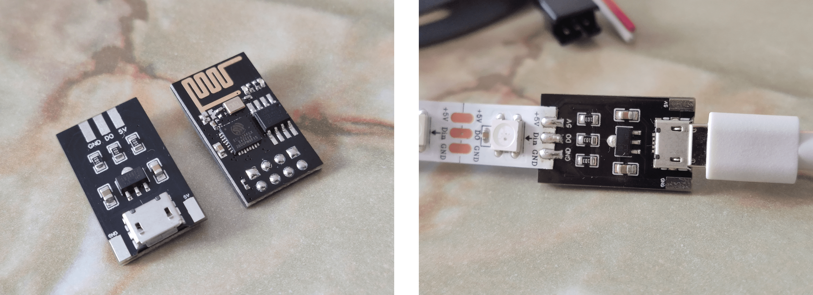
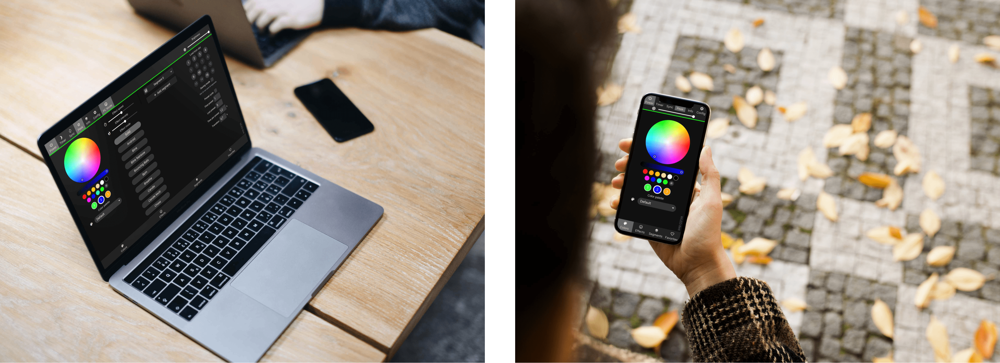
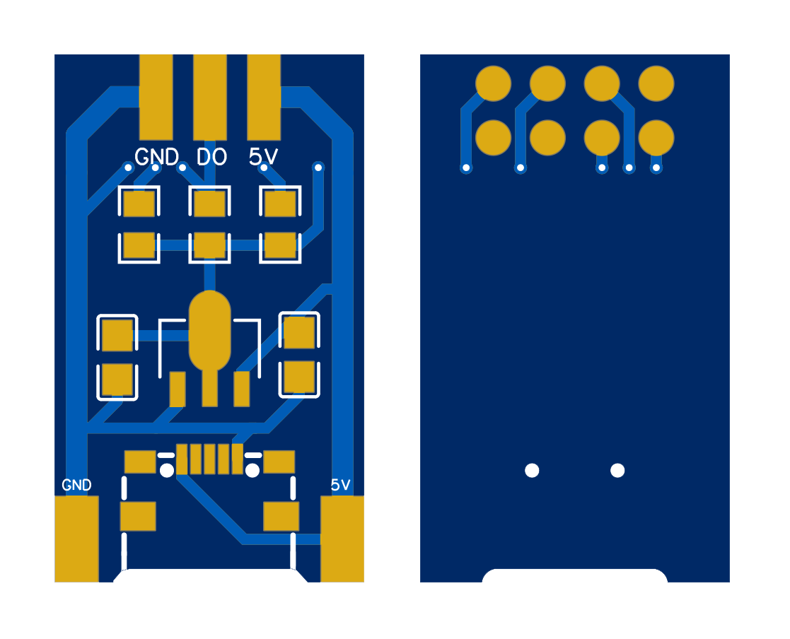
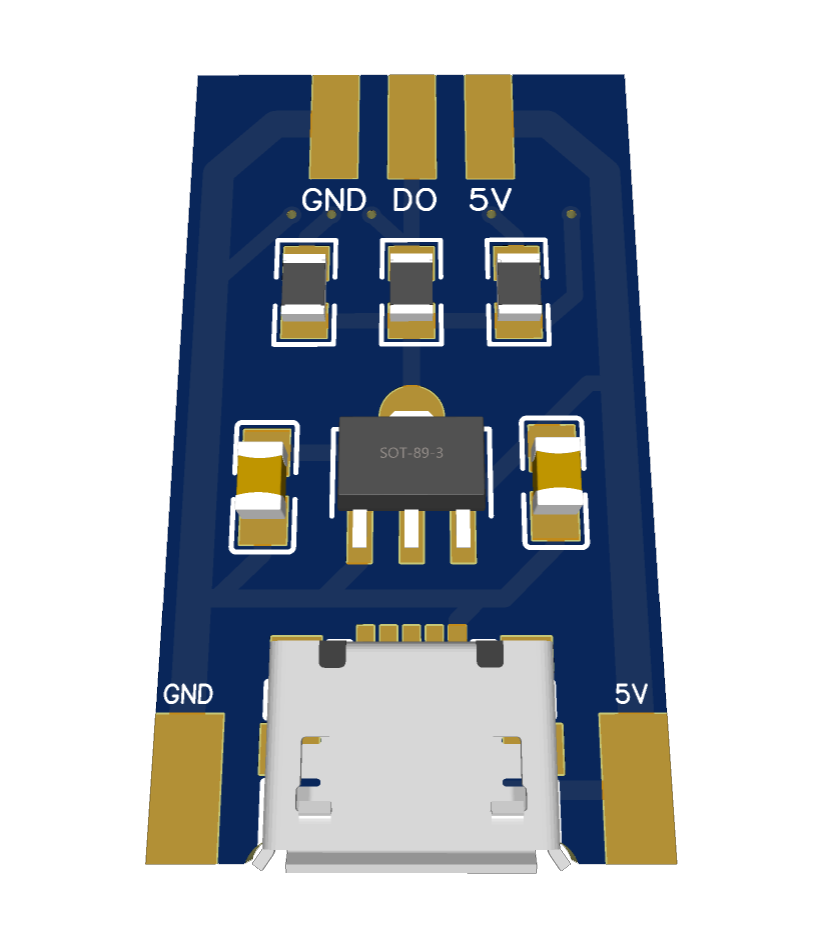

# WLED Controller
The smallest and the cheapest ESP-01 based controller for WS2812B LED strip. Controller size is 24.8x14.5 mm. Designed specifically for WLED firmware.

## Table of Contents
- [WLED Firmware](#wled-firmware)
- [Ambilight with Hyperion](#ambilight-with-hyperion)
  * [Ambilight videos](#ambilight-videos)
- [How to DIY](#how-to-diy)
  * [Schematic](#schematic)
  * [Printed circuit board](#printed-circuit-board)
  * [3D Model](#3d-model)
- [How to buy](#how-to-buy)

## WLED Firmware
<a href="https://github.com/Aircoookie/WLED">WLED by Aircoookie</a> is a fast and feature-rich implementation of an ESP8266/ESP32 webserver to control NeoPixel (WS2812B, WS2811, SK6812) LEDs!

Installed 4MB flash memory provides full WLED firmware support, including Over-The-Air updates.

## Ambilight with Hyperion
<a href="https://github.com/hyperion-project/hyperion.ng">Hyperion</a> is an open source implementation of Ambient Lighting that supports many LED devices and video capturers. 

WLED devices are discovered automatically by Hyperion.

### Ambilight videos
<video width="500" controls>
  <source src="videos/ambilight-test.mp4" type="video/mp4">
  Your browser does not support the video tag.
</video>

<video width="500" controls>
  <source src="videos/ambilight-game.mp4" type="video/mp4">
  Your browser does not support the video tag.
</video>

## How to DIY
You can assemble WLED Controller yourself using the information below.

### Schematic

- **MK1**: ESP-01/ESP-01s
- **U1**: AMS1117 3.3v, SOT-89
- **R1, R2, R3**: 10k, 0805
- **C1**: 10u, 0805
- **C2**: 22u, 0805
- **USB1**: Micro USB 5S-B

### Printed circuit board
The PCB (Gerber) files are in this repository.

### 3D Model

## How to buy
You will be able to purchase WLED Controller after **1 Nov 2022**. The purchase link will be on this page.
