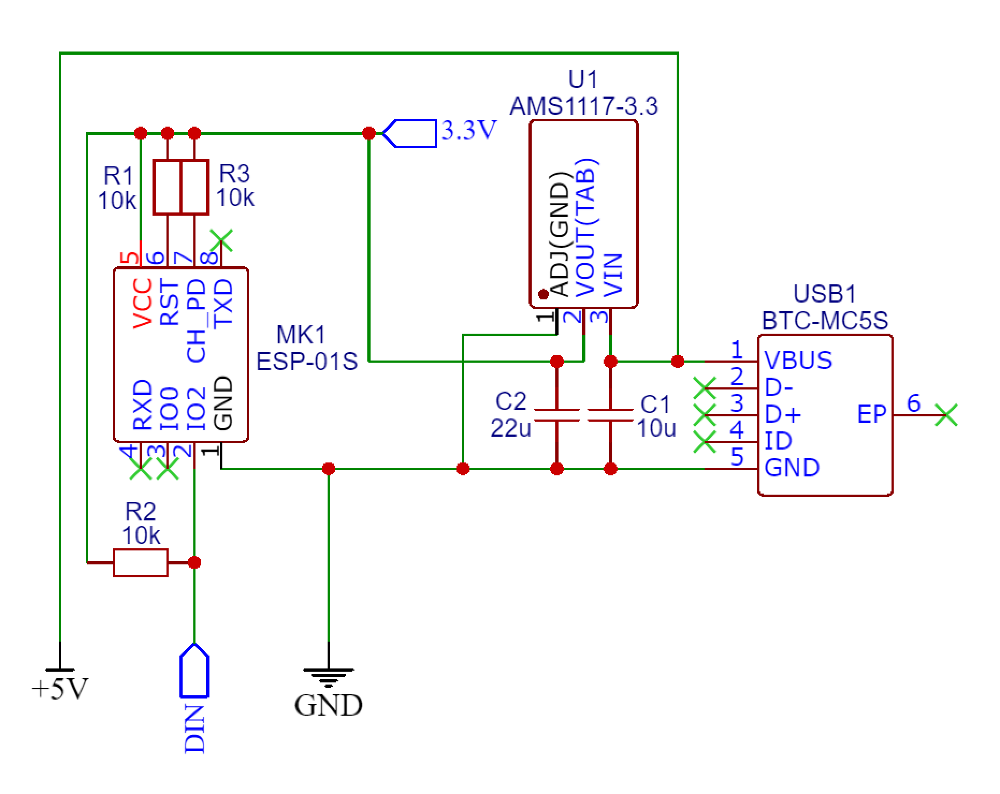

## WLED-Controller
The smallest and the cheapest ESP-01 based controller for WS2812B LED strip. Controller size is 24.8x14.5 mm. Designed specifically for WLED firmware.

### Schematic

### PCB

### 3D Model

